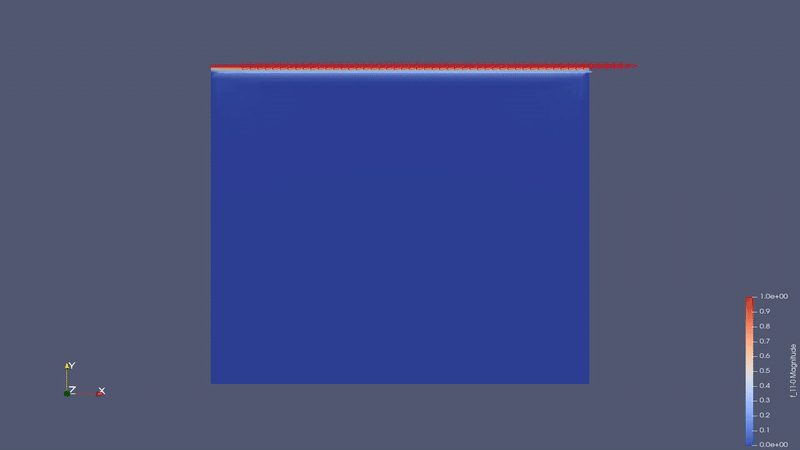

```
██╗     ██╗██████╗     ██████╗ ██████╗ ██╗██╗   ██╗███████╗███╗   ██╗     ██████╗ █████╗ ██╗   ██╗██╗████████╗██╗   ██╗    ███████╗██╗      ██████╗ ██╗    ██╗        
██║     ██║██╔══██╗    ██╔══██╗██╔══██╗██║██║   ██║██╔════╝████╗  ██║    ██╔════╝██╔══██╗██║   ██║██║╚══██╔══╝╚██╗ ██╔╝    ██╔════╝██║     ██╔═══██╗██║    ██║        
██║     ██║██║  ██║    ██║  ██║██████╔╝██║██║   ██║█████╗  ██╔██╗ ██║    ██║     ███████║██║   ██║██║   ██║    ╚████╔╝     █████╗  ██║     ██║   ██║██║ █╗ ██║        
██║     ██║██║  ██║    ██║  ██║██╔══██╗██║╚██╗ ██╔╝██╔══╝  ██║╚██╗██║    ██║     ██╔══██║╚██╗ ██╔╝██║   ██║     ╚██╔╝      ██╔══╝  ██║     ██║   ██║██║███╗██║        
███████╗██║██████╔╝    ██████╔╝██║  ██║██║ ╚████╔╝ ███████╗██║ ╚████║    ╚██████╗██║  ██║ ╚████╔╝ ██║   ██║      ██║       ██║     ███████╗╚██████╔╝╚███╔███╔╝        
╚══════╝╚═╝╚═════╝     ╚═════╝ ╚═╝  ╚═╝╚═╝  ╚═══╝  ╚══════╝╚═╝  ╚═══╝     ╚═════╝╚═╝  ╚═╝  ╚═══╝  ╚═╝   ╚═╝      ╚═╝       ╚═╝     ╚══════╝ ╚═════╝  ╚══╝╚══╝    

´´´
                                                                                                                                                                      

> A FEniCS-based solver for the time-dependent incompressible Navier-Stokes equations using mixed finite element methods.

---
     █████████   ███                             ████             █████     ███                         ███████████                               ████   █████           
    ███░░░░░███ ░░░                             ░░███            ░░███     ░░░                         ░░███░░░░░███                             ░░███  ░░███            
   ░███    ░░░  ████  █████████████   █████ ████ ░███   ██████   ███████   ████   ██████  ████████      ░███    ░███   ██████   █████  █████ ████ ░███  ███████    █████ 
   ░░█████████ ░░███ ░░███░░███░░███ ░░███ ░███  ░███  ░░░░░███ ░░░███░   ░░███  ███░░███░░███░░███     ░██████████   ███░░███ ███░░  ░░███ ░███  ░███ ░░░███░    ███░░  
    ░░░░░░░░███ ░███  ░███ ░███ ░███  ░███ ░███  ░███   ███████   ░███     ░███ ░███ ░███ ░███ ░███     ░███░░░░░███ ░███████ ░░█████  ░███ ░███  ░███   ░███    ░░█████ 
    ███    ░███ ░███  ░███ ░███ ░███  ░███ ░███  ░███  ███░░███   ░███ ███ ░███ ░███ ░███ ░███ ░███     ░███    ░███ ░███░░░   ░░░░███ ░███ ░███  ░███   ░███ ███ ░░░░███
   ░░█████████  █████ █████░███ █████ ░░████████ █████░░████████  ░░█████  █████░░██████  ████ █████    █████   █████░░██████  ██████  ░░████████ █████  ░░█████  ██████ 
    ░░░░░░░░░  ░░░░░ ░░░░░ ░░░ ░░░░░   ░░░░░░░░ ░░░░░  ░░░░░░░░    ░░░░░  ░░░░░  ░░░░░░  ░░░░ ░░░░░    ░░░░░   ░░░░░  ░░░░░░  ░░░░░░    ░░░░░░░░ ░░░░░    ░░░░░  ░░░░░░  
                                                                                                                                                                         
                                                                                                                                                                         
                                                                                                                                                                         


### Velocity Field


### Pressure Field


---

##  Problem Description

The **lid-driven cavity** is a classical benchmark problem in computational fluid dynamics. A fluid is enclosed in a square cavity where:

- The **top wall (lid)** moves with a constant horizontal velocity
- All **other walls** are stationary (no-slip condition)
- The fluid motion is driven entirely by the moving lid

This creates a primary recirculating vortex in the center and secondary vortices in the corners — making it a perfect test case for Navier-Stokes solvers.

---

##  Governing Equations

The incompressible Navier-Stokes equations:

**Momentum equation:**
```
ρ(∂u/∂t + u·∇u) = -∇p + μ∇²u
```

**Continuity equation:**
```
∇·u = 0
```

Where:
- `u` = velocity field
- `p` = pressure field
- `ρ` = fluid density
- `μ` = dynamic viscosity

---

##  Numerical Method

| Property | Details |
|---|---|
| **Solver** | FEniCS |
| **Formulation** | Mixed finite element method |
| **Velocity elements** | Taylor-Hood P2 |
| **Pressure elements** | P1 |
| **Time stepping** | Implicit (backward Euler) |
| **Domain** | Unit square [0,1] × [0,1] |

---

##  Boundary Conditions

| Boundary | Condition |
|---|---|
| Top wall (lid) | u = (1, 0) — moving lid |
| Left wall | u = (0, 0) — no-slip |
| Right wall | u = (0, 0) — no-slip |
| Bottom wall | u = (0, 0) — no-slip |

---

##  How to Run

### Prerequisites
```bash
pip install fenics
# or via conda:
conda install -c conda-forge fenics
```

### Run the simulation
```bash
python lid_driven_cavity.py
```

### Visualize results
Output `.pvd` or `.xdmf` files can be opened in **ParaView** for post-processing.

---

##  Parameters

```python
# Fluid properties
rho   = 1.0       # density
mu    = 0.01      # dynamic viscosity (Re = 100)

# Simulation settings
dt    = 0.01      # time step
T     = 5.0       # total time
nx    = 32        # mesh resolution (nx x nx)
```

To change the **Reynolds number**, adjust `mu`:
```
Re = rho * U * L / mu
```

---

## 📁 Repository Structure

```
📦 Lid_Driven_Cavity_Flow
 ┣ 📜 lid_driven_cavity.py   # Main solver script
 ┣ 🎞️ Velocity.gif           # Velocity field animation
 ┣ 🎞️ Prresure.gif           # Pressure field animation
 ┗ 📜 README.md
```

---

## 📚 References

- Ghia, U., Ghia, K. N., & Shin, C. T. (1982). High-Re solutions for incompressible flow using the Navier-Stokes equations and a multigrid method.
- FEniCS Project — [fenicsproject.org](https://fenicsproject.org)

---

<div align="center">
  Made with 🧮 + ☕ at <b>Universität Koblenz</b>
</div>
